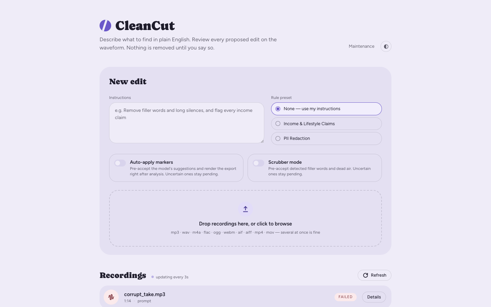
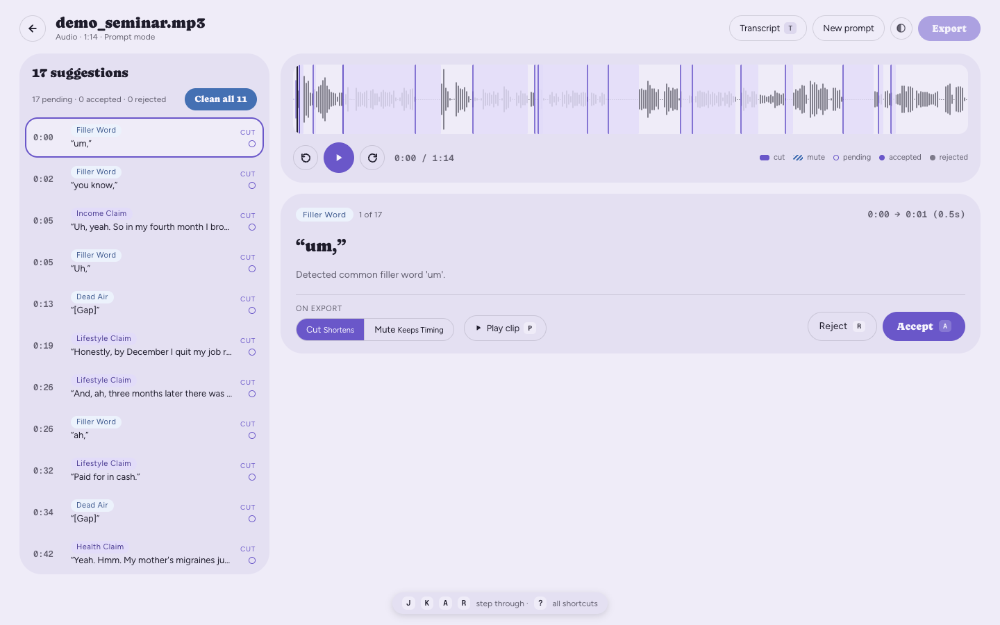
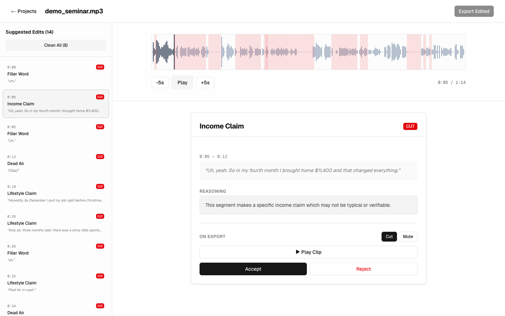
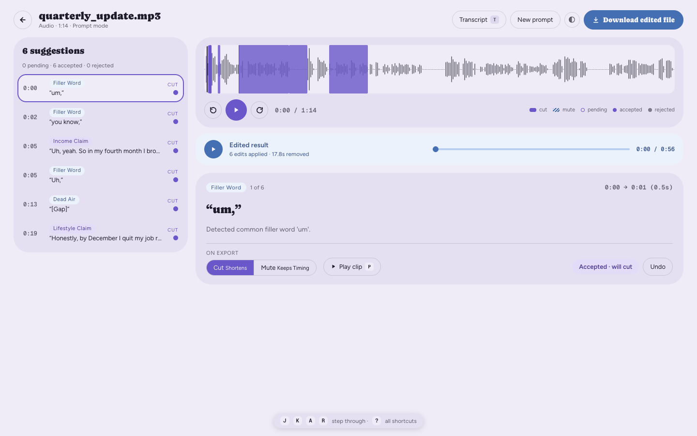

# CleanCut

Describe what to find in plain English. Review it on a waveform. Export a surgically edited file.

CleanCut transcribes audio or video with word-level timestamps, sends the transcript to an LLM
along with your instruction ("cut every filler word", "flag any specific dollar figure", "mute
anything that sounds like a phone number"), and turns the answers back into precise timestamps.
You review each suggestion on a waveform, accept or reject it, choose cut or mute per edit, and
export a single re-encoded file.

**Copilot, not autopilot.** Nothing is removed without a human accepting it.

## Key features

- **Word-level transcription** via `faster-whisper`, with int8 quantization for local CPU use.
- **Prompt-driven analysis** — a free-form instruction, not a fixed rulebook.
- **Rule presets** for recurring review jobs (income and lifestyle claims, PII redaction), selectable
  in place of a prompt.
- **Deterministic scrubber** — silence and filler-word detection straight off the word timestamps,
  no LLM involved, plus a one-click "Clean All" for those.
- **Interactive review** — a waveform with a marker per suggestion, and keyboard-driven
  accept/reject (`J`/`K` to move, `A`/`R` to decide and advance, `M` to flip cut/mute,
  `Space` to play, `P` to replay the selected clip, `T` for the transcript, `?` for the full list).
- **Searchable transcript panel** — the transcript the analysis actually ran on, kept with the job.
  Click a line to seek there, watch it follow playback, and see which lines carry a suggested edit.
- **Ask again without re-transcribing** — a new prompt or preset re-runs the analysis against the
  stored transcript, so changing the question costs one LLM call instead of another Whisper pass.
  Filler-word and dead-air edits, and your decisions on them, are kept across the re-run.
- **Per-edit cut or mute**, honored independently on export.
- **A/V-sync-preserving export** — a single FFmpeg `trim`/`atrim` + `concat` filter graph, so video
  stays in sync with its audio across every cut.
- **Background job queue** with per-stage status (`converting` → `transcribing` → `analyzing` →
  `exporting` → `completed`), polled by the frontend. Export is queued the same way, so a long
  re-encode never holds an HTTP request open.
- **Multi-language**, including code-switching between English and Spanish mid-sentence.
- **Bring your own model** — `CLEANCUT_MODEL=provider:model` picks the vendor and the model
  (`openai:gpt-4o`, `anthropic:claude-opus-5`). One line of `.env`, no code change.
- **Measured, not asserted** — a labelled synthetic clip and an eval harness that scores the
  detectors against it: precision, recall, and per-category coverage, run on every build.

## Screenshots

**Describe the job.** Free-form instructions, or a rule preset in place of them. Scrubber mode adds
the deterministic filler and silence pass; auto-apply pre-accepts what the detectors are sure of.



**Review on the waveform.** Every suggestion is a marker over the audio and a row in the sidebar.
This one is the scrubber's: a filler word, found off the word timestamps with no model involved.



**Read the reasoning before deciding.** The same screen with an LLM-found income claim selected —
the quoted span, why it was flagged, and the choice between cutting it and muting it.



**Export what you accepted.** One FFmpeg pass over the accepted edits — 1:14 of recording down to
0:53, playable in place before you download it.



## Architecture

| Layer | Stack |
|---|---|
| Backend | FastAPI, SQLAlchemy (SQLite), FFmpeg, OpenAI API |
| Frontend | Next.js 16, Tailwind CSS v4, Wavesurfer.js |
| Analysis | `faster-whisper` transcription, chunked sliding-window LLM analysis (OpenAI or Anthropic) |

```
upload → queue → Whisper (word timestamps) → LLM analysis → review UI → FFmpeg export
```

## Quickstart (Docker)

```bash
cp .env.example .env      # then add your model API key
docker compose up --build
```

Open http://localhost:3000.

## Quickstart (local)

Requires Python 3.10+, Node 18+, and FFmpeg (`brew install ffmpeg`).

```bash
# 1. Environment — a .env at the repo root, read by the backend
cp .env.example .env      # then add your model API key

# 2. Backend (port 8000)
cd backend
python3 -m venv .venv
source .venv/bin/activate
pip install -r requirements.txt
uvicorn app.main:app --reload

# 3. Frontend (port 3000), in a second terminal
cd frontend
npm install
npm run dev
```

Or run both with `./start.sh`.

Both quickstarts listen on **127.0.0.1** — CleanCut is reachable from this machine and nothing else.
Everything except the admin wipes is unauthenticated, so opening the port to a network is a decision
you type rather than a default you inherit: set `CLEANCUT_HOST=0.0.0.0` in `.env` and put a reverse
proxy that authenticates in front of it. See [Privacy](#privacy).

## Tests

```bash
cd backend
pip install -r requirements-dev.txt
pytest

cd ../frontend
npm test          # vitest + Testing Library, in jsdom - no browser needed
```

GitHub Actions runs both suites on every push and pull request, alongside `tsc --noEmit`, the
detector eval below, and a production frontend build — see `.github/workflows/ci.yml`.

## Eval

"The analyzer seems accurate" is not a claim worth making, so there is a number behind it.

`tests/fixtures/demo/` holds a synthetic two-speaker seminar clip with every detector's target
planted at a known offset — income, lifestyle and health claims, ten filler words, three dead-air
pauses, a code-switch into Spanish, and contact details. Alongside it, `eval_labels.json` records
what each line is and whether it should be flagged.

```bash
cd backend
source .venv/bin/activate
python -m app.eval.run ../tests/fixtures/demo/seed_job.json
```

```
  precision  100.0%   (14 suggestions graded)
  recall      80.0%   (15 labels in scope)

By category:
  income-claim     ############  1/1
  lifestyle-claim  ############  2/2
  health-claim     ############  1/1
  filler           ########....  5/8
  dead-air         ############  3/3
```

That run is a recorded snapshot of the real pipeline, so scoring it needs no API key, no model and
no media — which is why it runs in CI. What it grades is the scorer and the labels, not today's
code; its filler score is the one the harness found on the day it was built.

To grade the detectors **as they stand on this commit**, run them against the real audio and the
committed word-level transcript. Still free — no model, no API key — so CI gates on this one too:

```bash
python -m app.eval.run --detectors ../tests/fixtures/demo/demo_seminar.mp3 --suite scrub
```

```
  precision  100.0%   (11 suggestions graded)
  recall      91.7%   (12 labels in scope)

By category:
  filler           ##########..  7/8
  dead-air         ############  4/4
```

The one filler it misses is an "Er," that Whisper dropped from the transcript altogether — the
scrubber reads word timestamps, so a word the model never wrote is not a word it can find. The two
that used to be missed were the harness earning its keep: `FILLER_WORDS` held `"you know"` while
matching walked one word at a time, so the most common filler in English could never fire, and the
set spelled a sound `"hm"` that Whisper writes as `"Hmm"`.

To measure the whole pipeline as it stands, point it at the clip with
`--live ../tests/fixtures/demo/demo_seminar.mp3`, which transcribes and calls the LLM.
`--json` emits the scorecard for a machine, and `--min-recall` / `--min-precision` turn a threshold
into a non-zero exit.

Two details worth knowing about how it grades. A suggestion that quotes one tight clause of a
labelled line **counts** — cutting less is the better answer for an editor, and coverage is measured
against the shorter of the two spans so the scorer cannot punish precision. And the clip contains
two **controls**: an honest earnings disclaimer sitting between two income claims, and a neutral
follow-up question. Flagging either fails the run outright, whatever the aggregate numbers say —
they are the fixture's test for whether the analyzer is reading sentences or matching on the
neighbourhood.

## CLI

The analysis pipeline is also runnable standalone, without the web app:

Run it as a module from `backend/`, so the `app` package resolves:

```bash
cd backend
source .venv/bin/activate
python -m app.analysis.analyze path/to/audio.mp3 --prompt "flag every income claim"

# Or with a built-in preset instead of a prompt
python -m app.analysis.analyze path/to/audio.mp3 --preset income-claims

# Skip transcription and analyze an existing transcript
python -m app.analysis.analyze --transcript path/to/transcript.txt --prompt "find filler words"
```

## API

Interactive Swagger docs at http://localhost:8000/docs.

| Method | Endpoint | Description |
|---|---|---|
| POST | `/api/jobs` | Upload media and start processing |
| GET | `/api/jobs` | List jobs |
| GET | `/api/jobs/presets` | List the built-in rule presets |
| GET | `/api/jobs/{id}` | Job status and metadata |
| DELETE | `/api/jobs/{id}` | Delete a job and its files |
| GET | `/api/jobs/{id}/transcript` | The transcript the analysis ran on |
| POST | `/api/jobs/{id}/reanalyze` | Ask a new question about it — no re-transcription |
| GET | `/api/jobs/{id}/violations` | List suggested edits |
| PATCH | `/api/jobs/{id}/violations/{vid}` | Set status (accepted/rejected) or action (cut/mute) |
| POST | `/api/jobs/{id}/violations/bulk-update` | Bulk accept/reject/undo, filtered by label, id, or source status |
| GET | `/api/jobs/{id}/audio` | Stream the original media |
| GET | `/api/jobs/{id}/audio/waveform` | Cached waveform peaks |
| POST | `/api/jobs/{id}/export` | Queue the edited render (202; poll `export_status`) |
| GET | `/api/jobs/{id}/export/download` | Download the result |
| GET | `/api/admin/stats` | System statistics |
| POST | `/api/admin/reset-database`, `/clear-storage`, `/reset-all` | Destructive wipes; require `ADMIN_TOKEN`, and are disabled until one is set |

## Analysis modes

**Prompt mode** (default) — your instruction drives the analysis. Each suggestion comes back with a
label, a cut/mute recommendation, and the model's reasoning.

**Preset mode** — a curated rulebook replaces the prompt, and suggestions come back with a rule
category and a severity. Presets live in `backend/app/analysis/presets/` as markdown; adding one is
a new file plus an entry in `PRESETS` in `prompt_analyzer.py`.

| Preset | Purpose |
|---|---|
| `income-claims` | FTC-style earnings and lifestyle claim review for direct-selling material |
| `pii-redaction` | Spoken personal, financial, and credential data, defaulted to mute |

Long transcripts are chunked at 50 segments with a 10-segment overlap so nothing is missed at a
boundary, then deduplicated by label and timestamp proximity.

## Reviewing

Every suggestion is reviewed by hand — nothing is removed until you accept it. The review screen is
built for a keyboard pass: move down the list, decide, and the selection advances on its own.

| Key | Action |
|---|---|
| `J` / `↓` | Next suggestion |
| `K` / `↑` | Previous suggestion |
| `A` | Accept and advance |
| `R` | Reject and advance |
| `M` | Toggle cut ↔ mute on the selected edit |
| `Space` | Play / pause |
| `P` | Replay just the selected clip |
| `T` | Show or hide the transcript panel |
| `?` | Show or hide the shortcut list |

The transcript panel sits on the right, off by default. It scrolls to follow playback, clicking a
line seeks the waveform to it, and lines overlapping a suggested edit are marked in that edit's
colour — so a flagged quote can be read in context rather than judged from a marker alone. Jobs
processed before transcripts were stored simply don't offer the panel; the transcript cannot be
recovered without re-transcribing, and the API says so rather than returning an empty one.

The list scrolls to follow the selection, and the keys are ignored while a modifier is held or a
text field has focus. Decision keys (`A`, `R`, `M`) are also ignored while an edit is still in
flight, so holding one down cannot stack overlapping updates; navigation stays live throughout.

## Configuration

Set in `.env` at the repo root:

| Variable | Default | Purpose |
|---|---|---|
| `CLEANCUT_MODEL` | `openai:gpt-4o` | Which model analyses the transcript, as `provider:model`. `openai` or `anthropic` |
| `OPENAI_API_KEY` | — | Required when `CLEANCUT_MODEL` names `openai` |
| `ANTHROPIC_API_KEY` | — | Required when `CLEANCUT_MODEL` names `anthropic` |
| `CLEANCUT_HOST` | `127.0.0.1` | Which interface CleanCut listens on. Loopback by default; `0.0.0.0` exposes it to the network, which the unauthenticated media routes are not built for |
| `CORS_ORIGINS` | `http://localhost:3000` | Comma-separated allowed origins |
| `DATABASE_PATH` | `backend/audio_compliance.db` | SQLite file location |
| `BACKEND_ORIGIN` | `http://localhost:8000` | Where the frontend's own server finds the backend. The browser calls the frontend's `/api` and Next proxies it here, so the backend's address is never compiled into the page |
| `NEXT_PUBLIC_API_URL` | unset | Set it to have the browser call the backend directly instead of through the proxy. Cross-origin, so `CORS_ORIGINS` must name the frontend — and it is baked into the build, so changing it means rebuilding |
| `MAX_UPLOAD_MB` | `500` | Upload size cap; larger uploads are rejected with a 413 |
| `MAX_DURATION_MINUTES` | `120` | Media length cap, measured with `ffprobe` before queueing; media whose duration cannot be read is rejected |
| `RETENTION_HOURS` | unset | Delete jobs and their media once they are this old. Unset keeps everything forever |
| `RETENTION_SWEEP_MINUTES` | `15` | How often the retention sweeper runs |
| `ADMIN_TOKEN` | unset | Shared secret for the destructive admin routes, sent as an `X-Admin-Token` header. Unset **disables** those routes (503) rather than leaving them open |
| `ALLOW_UNAUTHENTICATED_ADMIN` | unset | `1` leaves the destructive admin routes open with no token, the way they used to be. For a machine you control only; ignored when `ADMIN_TOKEN` is set, and ignored once `CLEANCUT_HOST` is not loopback |
| `SKIP_PREFLIGHT` | unset | Boot despite a failed startup check (jobs will still fail) |

## Failure modes

The backend runs a preflight at startup and refuses to boot if the configured provider's API key is
missing or `ffmpeg`/`ffprobe` are not on PATH — both are otherwise only reached minutes into a job, where a
missing line in `.env` looks like an application bug.

Uploads are capped by size and by duration; both come back as a 413 with the limit named, and the
rejected job is not left behind in the jobs list. The duration cap fails closed — a file `ffprobe`
cannot read a duration from is rejected with a 422, since a limit that any unprobeable stream can
skip is not a limit.

Both caps are enforced **after** the multipart body has been read, so `MAX_UPLOAD_MB` bounds what
CleanCut *keeps*, not what a client can make it receive: Starlette spools the upload to a temp file
before the handler runs, and a 50 GB POST costs 50 GB of scratch disk on its way to a 413. That is a
storage-hygiene control, not a DoS control, and it cannot be fixed inside the handler — the body is
already on disk by the time any application code sees it. On loopback, which is the default trust
model here, the client is you. Anywhere else, cap the body at the reverse proxy in front of CleanCut
(`client_max_body_size` in nginx, `limitRequestBody` in Caddy) and set it to match `MAX_UPLOAD_MB`.

When the model returns something that isn't a readable list of suggestions, that is reported rather
than silently treated as "nothing found" — a distinction that matters when the output is a
compliance review. A single unreadable chunk of a long transcript leaves the job completed with a
partial-analysis warning naming the unanalyzed timespans; if every chunk fails, the job fails. The
same applies to entries that parse but say nothing actionable — an item with no quoted text or an
unknown action fails its chunk rather than becoming an empty edit that `auto_fix` would apply.

Work queued for the worker survives a restart. The queue is a table, not just a list in memory, so
a deploy, a crash or a closed laptop no longer throws away every job that had been accepted and not
yet run — on the next boot the outstanding tasks are picked up in the order they were queued. A
task that has taken the process down three times is abandoned rather than replayed a fourth, with
the reason recorded on the job; one interrupted so late that only the job's status remembers it is
marked failed with a message saying to try again, rather than re-run over the top of a review you
have already done.

The CLI carries the same status: the saved JSON includes `is_partial` and `failed_chunks`,
`total_segments_analyzed` counts only segments a chunk actually answered for, and a partial run
exits 2 so a script cannot read it as clean.

## Privacy

Transcription runs locally on your machine. Only the resulting transcript text is sent to the LLM
provider — never the audio. Jobs, uploads, exports, and the stored transcript stay on local disk
(SQLite plus `backend/uploads/` and `backend/exports/`). Use the admin dashboard at `/admin` to
wipe both.

The wipe endpoints delete everything, so they are off until you configure them: with no
`ADMIN_TOKEN` set they answer 503 rather than running. Set one — the dashboard has a field for it,
stored in that browser only — and they require it as an `X-Admin-Token` header. If you would rather
have the old one-click reset on your own laptop, `ALLOW_UNAUTHENTICATED_ADMIN=1` restores it; that
is a deliberate choice to leave the delete button open to anything that can reach the port, which is
why a blank line in `.env` no longer does it for you.

The rest of the API is unauthenticated: anything that can reach the port can list the jobs, stream
the original recording, read the transcript and download the export. So the port is the access
control, and it is **loopback by default** — `start.sh` binds `127.0.0.1` and `docker compose`
publishes on `127.0.0.1`. CleanCut is a local-only tool, and running it that way needs no flag.

`CLEANCUT_HOST=0.0.0.0` opens it to the network, in both the script and Compose. That is supported,
and it is a decision: the backend prints a warning at startup saying what is now readable, and
`ALLOW_UNAUTHENTICATED_ADMIN` stops being honoured, since "anything that can reach the port may wipe
everything" is not what an operator agreed to once a network can reach it. Put a reverse proxy that
authenticates in front before you do this.

Nothing is deleted on a timer unless you ask for it. Set `RETENTION_HOURS` and a background sweeper
deletes each job — its row, its violations, its upload, and its export — once it is that old, along
with any media left on disk that no job refers to any more. A job still moving through the pipeline
is never collected however old it is, since the queue is sequential and a job can wait a long time
behind a long one. The default is unset, because on your own laptop the recordings are yours and
deleting them by surprise is the worse failure.

## License

MIT — see [LICENSE](LICENSE).
