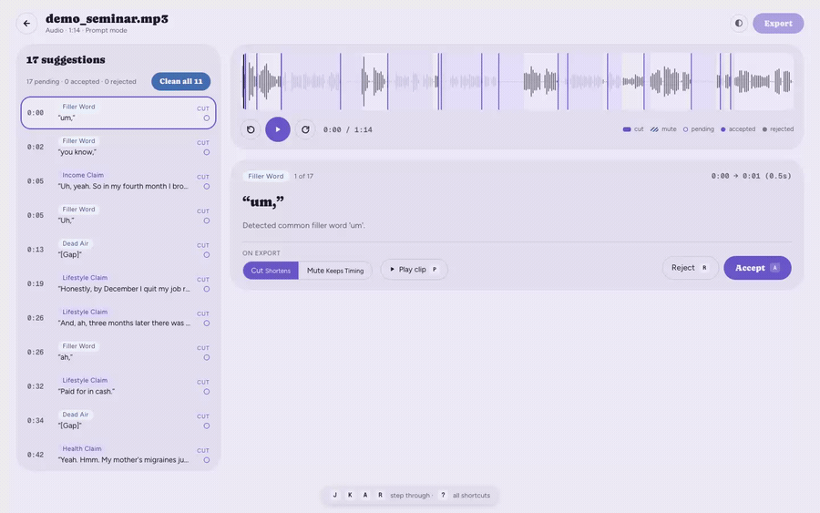

# Quick Wins — Implementation Plan

## Context

`repository-audit-2026-09-03.md` graded CleanCut as top-2% portfolio work whose weaknesses are
almost entirely in the **packaging and automation shell**, not the code. §5.1 lists eight quick wins,
each under an hour. This plan implements all eight.

The through-line: the repo's substance is already strong and already *measured* (a CI-gated
detector eval at 1.00 precision / 0.92 recall), but a reader has no way to see any of that in the
first five seconds. Three files actively mislead — the README advertises GHCR images under the wrong
owner that don't exist, `docs/ARCHITECTURE.md` documents Celery, Zustand and VAD (VAD was
*explicitly rejected*), and `frontend/README.md` is untouched create-next-app boilerplate pointing at
a directory that isn't there. Meanwhile `CLAUDE.md` asserts "eslint runs clean" with nothing
enforcing it, and there is no automation to prevent a repeat of the Next.js-with-28-advisories
incident (`0d0343c`).

Outcome: a README that sells in five seconds, three lying files corrected, CI that enforces what the
docs claim, dependency automation, and a real `v0.1.0` release so the pull commands work.

### Facts verified during planning

- Remote is `julianavellaneda/ai-audio-editing`; `git tag` is **empty**. `release.yml` derives images
  from `${{ github.repository_owner }}` and triggers only on `v*`.
- `npm run lint` (eslint 9, `frontend/eslint.config.mjs`) **exits 0 clean today** — safe to gate on.
- `docs/assets/` already exists with four current PNGs; the GIF lands beside them.
- `docs/demo/captures/scene-06-review.mp4` — 22.2s, 1440×900, 615 KB.
- Detector eval today: **1.00 precision / 0.92 recall**, floored in CI at 0.95 / 0.85.
- No `.env` is tracked (only `.env.example`).

### Decisions taken with the user

| Question | Decision |
|---|---|
| GHCR owner + release tag | Fix the owner **and** tag `v0.1.0` (confirm before pushing) |
| Demo format | Trimmed, palette-optimized **GIF** at the top of the README |
| `docs/ARCHITECTURE.md` | **Rewrite** to match the code |
| `frontend/README.md` | **Replace** with three lines |

---

## Work

### 1. Demo GIF at the top of the README — *highest ROI in the audit*

Generate from the existing capture. Two-pass palette so text in the UI stays legible:

```bash
cd .
ffmpeg -y -t 12 -i docs/demo/captures/scene-06-review.mp4 \
  -vf "fps=12,scale=900:-1:flags=lanczos,palettegen=stats_mode=diff" /tmp/pal.png
ffmpeg -y -t 12 -i docs/demo/captures/scene-06-review.mp4 -i /tmp/pal.png \
  -lavfi "fps=12,scale=900:-1:flags=lanczos[x];[x][1:v]paletteuse=dither=bayer:bayer_scale=3" \
  docs/assets/demo.gif
```

Then **check `ls -lh docs/assets/demo.gif`**. Target ≤ 5 MB. If it overruns, tune in this order:
`-t 10` → `scale=800` → `fps=10`. Do not drop below 10fps; the waveform scrub reads as broken.

Embed it between the hook (README line 3) and `## Key features`, with a line pointing at the
full-quality scene captures already in the repo:

```markdown


*Reviewing suggestions on the waveform. Full-quality captures of the whole flow — upload, pipeline,
review, cut/mute, export — are in [`docs/demo/captures/`](docs/demo/captures/).*
```

### 2. Badges

Insert a badge row between README line 1 (`# CleanCut`) and line 3 (the hook). Five badges; the
last one is the differentiated one and is **hardcoded** (no service publishes it):

```markdown
[](https://github.com/julianavellaneda/ai-audio-editing/actions/workflows/ci.yml)
[](LICENSE)
[](https://www.python.org/downloads/)
[](https://github.com/julianavellaneda/ai-audio-editing/pkgs/container/cleancut-backend)
[](#accuracy-measured-not-asserted)
```

The eval badge's anchor must point at the README's existing eval-numbers section — confirm the
heading slug while editing and adjust the `#fragment` to match. Because it is hardcoded, add a
one-line comment in `ci.yml` beside the detector-eval step noting the badge must be updated if the
recorded numbers move.

### 3. Fix the GHCR owner, then cut `v0.1.0`

`README.md:89-90` — `old-owner` → `julianavellaneda`. That string appears nowhere else in the repo.

Do this **last**, after every other change is committed, so the tag points at a commit where the
README is true:

```bash
git tag -a v0.1.0 -m "CleanCut v0.1.0"
git push origin v0.1.0
```

> **Confirm with the user before `git push origin v0.1.0`.** It is outward-facing and effectively
> irreversible — it triggers `release.yml`, which publishes two public GHCR images. After the push,
> watch the run and verify both images land under `ghcr.io/julianavellaneda/cleancut-{backend,frontend}`;
> report the result rather than assuming it succeeded.

### 4. `npm run lint` in CI

In `.github/workflows/ci.yml`, add a step to the `frontend` job **before** Type-check (lint is the
cheapest signal, so it should fail first):

```yaml
      # CLAUDE.md states "eslint runs clean". This is what makes that a fact
      # rather than an assertion.
      - name: Lint
        working-directory: frontend
        run: npm run lint
```

Verified clean locally, so this should not turn the build red.

### 5. `.github/dependabot.yml`

Three ecosystems, weekly, grouped so a quiet week is one PR rather than nine. This is the automation
that prevents a repeat of `0d0343c`:

```yaml
version: 2
updates:
  - package-ecosystem: pip
    directory: /backend
    schedule: { interval: weekly }
    groups:
      backend: { patterns: ["*"] }
  - package-ecosystem: npm
    directory: /frontend
    schedule: { interval: weekly }
    groups:
      frontend: { patterns: ["*"] }
  - package-ecosystem: github-actions
    directory: /
    schedule: { interval: weekly }
    groups:
      actions: { patterns: ["*"] }
```

Note in the file's own comment that `backend/requirements.txt` is all `>=` floors with no lockfile,
so pip updates will be advisory-driven only — the real fix is the `requirements.lock` in the audit's
§5.2, out of scope here.

### 6. Replace `frontend/README.md`

Delete all 36 lines of boilerplate (which point at `app/page.tsx`; the code is under `src/`) and
replace with a short pointer:

```markdown
# CleanCut — frontend

The Next.js 16 review interface. Source lives under `src/`; `src/app/jobs/[id]/page.tsx` is the
review screen and `src/lib/api.ts` is the only place the backend is called from.

```bash
npm install && npm run dev   # needs the backend on :8000 — see ../README.md
```

Design tokens, the contrast audit and the four rules the components are held to are documented in
[`../CLAUDE.md`](../CLAUDE.md#design-system).
```

### 7. Rewrite `docs/ARCHITECTURE.md`

The current 45 lines are written in "Future State" tense and are wrong in three ways that matter:
"Python/**Celery**-style" worker (it is a threaded queue over a SQLite `tasks` table),
"`Zustand`/Context" (not a dependency), and "**VAD** flags silences" — which `ROADMAP.md` and
`CLAUDE.md` both record as *deliberately rejected*, since VAD makes the same mistake gap-detection
did and flags room tone, applause and music beds.

Replace with ~70 lines of present-tense description, sourced from `CLAUDE.md` (which is accurate)
and verified against the code:

- **System overview** — Next.js frontend → its own `/api` route handler proxying to `BACKEND_ORIGIN`
  (`frontend/src/app/api/[...path]/route.ts`) → FastAPI → threaded worker. Say explicitly that the
  proxy is a *route handler* not a `rewrites()` entry, and why.
- **Data flow**, present tense: upload → convert → transcribe (`analysis/transcriber.py`) → LLM
  analyze (`analysis/prompt_analyzer.py`, chunked 50/10 sliding window) → deterministic scrub
  (`services/scrubber.py`) → review → single-pass FFmpeg filter graph (`services/media_editor.py`).
- **The durable queue** — `services/task_store.py` + the `tasks` table, row-written before the
  in-memory put, `MAX_ATTEMPTS = 3` poison cutoff, `recover_interrupted_work()` two-pass replay.
- **Silence detection is a two-signal agreement**, not VAD: the transcript proposes a gap and an RMS
  pass (`services/levels.py`) must confirm it below `DEAD_AIR_FLOOR_DB`. **Name VAD as rejected and
  say why** — that is the sentence the current file gets backwards.
- **Export staleness** — `edit_revision` / `export_revision`, `exports.py` as sole owner of
  `EXPORT_DIR` and the naming rule.
- **Trust boundaries** — the transcript is data not instructions (`_wrap_transcript`,
  `DATA_NOT_INSTRUCTIONS`); fail-closed admin auth; loopback-by-default binding. Cross-link
  `SECURITY.md`.
- A short **"what this is not"** list (no Celery, no Redis, no Zustand, no VAD) so the next reader
  who half-remembers this file is corrected rather than confused.

Add a header line pointing at `CLAUDE.md` as the deeper reference, and a note that `GEMINI.md`
mirrors it — the audit flags two hand-maintained copies as a drift generator, and `CLAUDE.md`'s own
conventions section requires updating both.

### 8. `CODE_OF_CONDUCT.md` and `CHANGELOG.md`

- **`CODE_OF_CONDUCT.md`** — Contributor Covenant v2.1 verbatim, with the enforcement contact set to
  the GitHub-handle route already used by `SECURITY.md` (read that file first and match its contact
  convention rather than inventing an email).
- **`CHANGELOG.md`** — Keep a Changelog format, seeded with a single `## [0.1.0] - 2026-09-04`
  entry (use the actual date the tag is cut, not the audit's date). Not a commit dump: group the 67 commits' worth of substance under `Added` (prompt-driven
  analysis, presets, deterministic scrubber, waveform review, keyboard path, transcript panel,
  re-analysis, async export, model router, eval harness, Docker/GHCR) and `Security` (fail-closed
  admin auth, loopback binding, prompt-injection fencing, upload caps). Add link-reference
  definitions at the bottom for the `v0.1.0` compare URL.

Add a line to `CONTRIBUTING.md` telling contributors to add an `## [Unreleased]` entry — a changelog
nobody is told to update stops after one release.

---

## Files touched

| Path | Change |
|---|---|
| `README.md` | Badge row, demo GIF embed, GHCR owner fix |
| `docs/assets/demo.gif` | **New** (generated binary, ≤5 MB) |
| `.github/workflows/ci.yml` | Add Lint step; comment on the hardcoded eval badge |
| `.github/dependabot.yml` | **New** |
| `frontend/README.md` | Rewritten (36 lines → ~10) |
| `docs/ARCHITECTURE.md` | Rewritten (45 lines → ~70, present tense, accurate) |
| `CODE_OF_CONDUCT.md` | **New** |
| `CHANGELOG.md` | **New** |
| `CONTRIBUTING.md` | One line: add an Unreleased entry |
| *(git)* | `v0.1.0` annotated tag — pushed only on explicit confirmation |

## Explicitly out of scope

Audit §5.2 strategic items — `requirements.lock`, ruff/mypy, `pytest --cov`, the `mock:` provider,
devcontainer, word-level transcript editing, detector plugin protocol, and the README split into
`docs/CONFIGURATION.md` / `docs/API.md` / `docs/FAILURE_MODES.md`. The README stays 396 lines plus
the additions here; splitting it is a separate pass.

Also untouched, per audit §5.3: no `FUNDING.yml`.

---

## Verification

Run in this order; everything below is free and needs no API key.

1. **GIF** — `ls -lh docs/assets/demo.gif` is ≤5 MB, and it opens and animates
   (`open docs/assets/demo.gif`).
2. **README renders** — check the badge row and the GIF path resolve. Every badge URL is
   reachable and the eval badge's `#fragment` scrolls to the real heading.
3. **Lint gate** — `cd frontend && npm run lint` exits 0 (confirmed clean pre-change; re-confirm).
4. **Full CI locally**, exactly what `CONTRIBUTING.md` documents:
   ```bash
   cd backend && source .venv/bin/activate && pytest
   python -m app.eval.run ../tests/fixtures/demo/seed_job.json
   python -m app.eval.run --detectors ../tests/fixtures/demo/demo_seminar.mp3 \
     --suite scrub --min-precision 0.95 --min-recall 0.85
   cd ../frontend && npm run lint && npx tsc --noEmit && npm test && npm run build
   ```
   The detector eval must still print **1.00 / 0.92**; if it doesn't, the hardcoded badge in §2 is
   wrong and must be corrected before the tag.
5. **Workflow syntax** — `.github/dependabot.yml` and the edited `ci.yml` parse:
   `python -c "import yaml,sys; [yaml.safe_load(open(p)) for p in sys.argv[1:]]" .github/dependabot.yml .github/workflows/ci.yml`
6. **Push the branch and watch CI go green** with the new Lint step, *before* tagging.
7. **After the tag push** (confirmed separately) — `gh run watch` on the Release workflow, then
   `docker pull ghcr.io/julianavellaneda/cleancut-backend:v0.1.0` to prove the README's command
   now works. Report the actual result.
8. **Dependabot** — after push, confirm GitHub → Insights → Dependency graph → Dependabot lists
   three ecosystems as configured.
